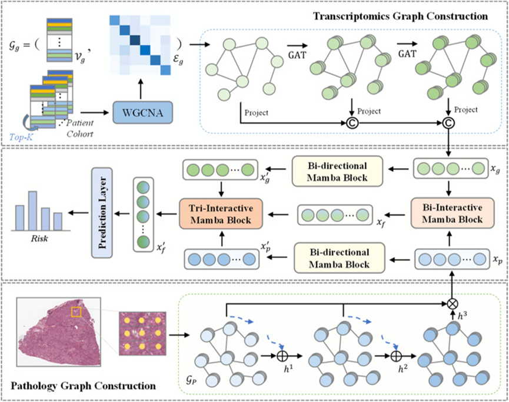

# MGCM: Multi-modal Graph Convolutional Mamba for Cancer Survival Prediction

<details>
<summary>
  <a href="https://www.sciencedirect.com/science/article/abs/pii/S003132032500651X" target="blank">
  <b> MGCM: Multi-modal Graph Convolutional Mamba for Cancer Survival Prediction</b></a>, Pattern Recognition.
  <br> &nbsp;&nbsp; Jiaqi Cui, Yilun Li, Dinggang Shen, Yan Wang. <br/>
</summary>
</details>

## **📌 Summary**



1. We propose a Multi-modal Graph Convolutional Mamba (MGCM) framework for cancer survival prediction based on pathology images and transcriptomic profiles. Our proposed MGCM framework tackles insufficient intra-modal learning, particularly in transcriptomics, and improves cross-modal interactions.
2. We construct multi-modal graphs for pathology images and transcriptomics to enhance intra-modal representations. In this process, transcriptomics is formatted into a co-expression network and modeled with a multi-level graph convolutional network to comprehensively capture the expression levels of individual genes and their co-expressions with other genes. Meanwhile, pathology images are represented as graphs based on spatial relationships between patches, which are then learned in a sample-and-aggregate manner to encourage the excavation of different characteristics within tumor cells and microenvironment.
3. We develop a progressive strategy that employs a Bi-Interactive Mamba block to model initial cross-modal correlations, followed by a Tri-Interactive Mamba block to prioritize critical information and filter redundancies for further refinement, thereby achieving comprehensive cross-modal interactions.

## **🛠️ Installation Guide for Linux (Using Anaconda)**

### **Pre-requisites:**

- **Main Environment:** Linux (Tested on Ubuntu 20.04),  NVIDIA GPU (Tested on NVIDIA GTX 3090).

```bash
# Install Python and PyTorch
conda create -n your_env_name python=3.10.13
conda activate your_env_name
pip install torch==2.1.1 torchvision==0.16.1 torchaudio==2.1.1 --index-url https://download.pytorch.org/whl/cu118

# Install causal_conv1d and mamba_ssm
pip install causal_conv1d==1.1.3
pip install mamba_ssm==1.1.1
```

- **Mamba Library:** After installing the Mamba library, replace the mamba_simple.py file and selective_scan_interface.py file in the installation directory with the corresponding files in this repository. If any issues arise during  the process in the Mamba environment, refer to [[Blog]](https://blog.csdn.net/yyywxk/article/details/136071016), [[Mamba]](https://github.com/state-spaces/mamba), and [[Vision Mamba]](https://github.com/hustvl/Vim) for solutions.

```
./Anaconda/envs/your_env_name/Lib/site-packages/mamba_ssm/
    └──modules/
        ├── __pycache__/
        ├── __init__.py
        └── **mamba_simple.py**
    └──ops/
        ├── triton/
        ├── __pycache__/
        ├── __init__.py
        └── **selective_scan_interface.py**
    └──utils/
        └── ...
    └──models/
        └── ...
    └──__pycache__/
        └── ...
    └──__init__.py
```

- **PyTorch Geometric:** Based on the currently used torch and CUDA versions, install directly via pip or conda commands following the steps on the [[PyG]](https://pytorch-geometric.readthedocs.io/en/latest/notes/installation.html). If installation via the above method is problematic, locate the corresponding packages on the [[pyg]](https://data.pyg.org/whl/) , then execute the following commands in sequence to download them.

```bash
pip install torch-scatter -f https://pytorch-geometric.com/whl/torch-2.1.1+cu118.html
pip install torch-sparse -f https://pytorch-geometric.com/whl/torch-2.1.1+cu118.html
pip install torch-cluster -f https://pytorch-geometric.com/whl/torch-2.1.1+cu118.html
pip install torch-spline-conv -f https://pytorch-geometric.com/whl/torch-2.1.1+cu118.html
pip install torch-geometric -i https://pypi.tuna.tsinghua.edu.cn/simple
```

## **🔧 Installation Guide for Linux (Using RStudio)**

### **Pre-requisites:**

- **Download R:** The [[Latest Version]](https://cran.r-project.org/) of R / The [[Specified Version]](https://docs.posit.co/resources/install-r.html) of R.

```bash
sudo apt-get update
sudo apt-get install gdebi-core

# Specify R version, download and install R
export R_VERSION=4.4.2
curl -O https://cdn.rstudio.com/r/ubuntu-${UBUNTU_VERSION}/pkgs/r-${R_VERSION}_1_amd64.deb
sudo gdebi r-${R_VERSION}_1_amd64.deb
/opt/R/${R_VERSION}/bin/R --version

# Create a symlink to R
sudo ln -s /opt/R/${R_VERSION}/bin/R /usr/local/bin/R
sudo ln -s /opt/R/${R_VERSION}/bin/Rscript /usr/local/bin/Rscript

# config rstudio-server
vim /etc/rstudio/rserver.conf
# rsession-which-r=/usr/local/bin/R
sudo rstudio-server restart
```

- **Install RStudio:** [[RStudio Server]](https://posit.co/download/rstudio-server/) is able to run the RStudio IDE on the Linux server, and accessed from the web browser.

```bash
sudo apt-get install gdebi-core
wget https://download2.rstudio.org/server/jammy/amd64/rstudio-server-2025.05.1-513-amd64.deb
sudo gdebi rstudio-server-2025.05.1-513-amd64.deb
```

- **Test access:** After installation, open the browser and access it.

```bash
http://{Server IP}：8787
```

## **📚 Data Preparation**

### **Downloading TCGA Data**

- To download diagnostic WSIs (formatted as .svs files), transcriptomics data and other clinical metadata, please refer to the [[NIH Genomic Data Commons Data Portal]](https://portal.gdc.cancer.gov/) and the [[cBioPortal]](https://www.cbioportal.org/). WSIs for each cancer type can be downloaded using the [[GDC Data Transfer Tool]](https://docs.gdc.cancer.gov/Data_Transfer_Tool/Users_Guide/Data_Download_and_Upload/).

### **Splitting TCGA Data**

- For evaluating the algorithm's performance, we randomly partitioned each dataset using 5-fold cross-validation. Splits for each cancer type are found in the [splits/tcga] folder, which each contain **splits_{k}.csv** for k = 0 to 4. In each **splits_{k}.csv**, the first column corresponds to the TCGA Case IDs used for training, and the second column corresponds to the TCGA Case IDs used for validation. Alternatively, one could define their own splits, however, the files would need to be defined in this format.

## **📝 Data Processing**

### **🔬 Processing Whole Slide Images**

- To process WSIs, we used [[CLAM]](https://github.com/mahmoodlab/CLAM/tree/master#wsi-segmentation-and-patching). First, the tissue regions in each biopsy slide are segmented using Otsu's Segmentation on a downsampled WSI using OpenSlide. The 256 x 256 patches without spatial overlapping are extracted from the segmented tissue regions at 20× magnification. Subsequently, [[PLIP]](https://github.com/PathologyFoundation/plip) base model pre-trained by OpenPath is used to encode raw image patches into 512-dim feature vectors.
- Follow the practice of [[Patch-GCN]](https://github.com/mahmoodlab/Patch-GCN). First, the spatial coordinates of each patch are recorded and used as input to construct [[WSI-Graph]](https://github.com/mahmoodlab/Patch-GCN/blob/master/WSI-Graph%20Construction.ipynb) together with the features, resulting k-nearest neighbor (k=8) spatial graph. Then, they are fed together to the Graph Neural Network [[GNN Encoder]](https://github.com/mahmoodlab/Patch-GCN/blob/master/models/model_graph_mil.py) based on GraphSAGE. Finally, the extracted features then serve as input (in a .pt file) to the network.

### **🧬 Processing Transcriptomics Profiles**

- **Differential Expression Analysis:** The differential expression ****analysis can be performed on standardized RNA-Seq data (Z-score) using the Linear model [[limma]](https://www.bioconductor.org/packages/release/bioc/html/limma.html) package, or on original RNA-Seq data using the Negative Binomial Distribution model [[DESeq2]](https://bioconductor.org/packages/release/bioc/html/DESeq2.html) package. Based on medical scenario and research objectives, patients in the training cohort were stratified into long/short or long/intermediate/short survival subgroups by median/tertile of overall survival time. Differential expressed genes (DEGs) were identified via two-step filtering: false discovery rate (FDR) and absolute log2 fold change (|log2FC|). Top-K DEGs were selected using combined significance scores.

```bash
# Applicable to standardized expression data
if (!require("BiocManager", quietly = TRUE))
    install.packages("BiocManager")
BiocManager::install("limma")
library(limma)

run DEGs_limma.R

# Applicable to original expression data
if (!require("BiocManager", quietly = TRUE))
    install.packages("BiocManager")
BiocManager::install("DESeq2")
library(DESeq2)

run DEGs_DESeq2.R
```

- **Co-expression Network Analysis:** Based on Power, MinModuleSize and MergeCutHeight, weighted correlation network analysis [[WGCNA]](https://bmcbioinformatics.biomedcentral.com/articles/10.1186/1471-2105-9-559) was conducted on the Top-K DEGs , resulting in the corresponding Adjacency Matrix A∈R^(K×K). In order to balance network biology principles with computational efficiency, the key parameters for WGCNA should be adjusted based on the specific dataset and analysis goals.
1. Power determines the topological structure of the gene co-expression network. It aims to approximate a scale-free topology while maintaining moderate connectivity. Select the smallest power where R² ≥ 0.85. If R² < 0.85, choose the inflection point on the curve.
2. MinModuleSize limits the minimum number of genes required to form a module. Depending on the size of dataset size and the desired granularity, typical values range from 10~30.
3. MergeCutHeight controls sensitivity for merging similar modules. Lower values promote merging, while higher values retain more distinct modules. Start with 0.25 as a default.

```bash
# Install and load WGCNA
install.packages("BiocManager")
BiocManager::install("WGCNA")
library(WGCNA)

# Tune parameters
run WGCNA_Power.R
run WGCNA_MinModuleSize.R
run WGCNA_MergeCutHeight.R

# Gene Co-expression Network Analysis
run WGCNA.R
```

- **Construct Edge Matrix:** Set the corresponding threshold “γ” for different datasets, binarize the continuous values in the Adjacency Matrix A, and construct the Edge Matrix E of the gene co-expression graph, which nodes with similar gene expression are connected by edges, while other nodes are not connected by edges.

```bash
run adjacency_matrix_generator.py
```

## **📩 Data Obtaining**

- **Download Patch Features:** We provide the relevant features of histopathology images, the download link is as follows: [[Baidu Cloud]](https://pan.baidu.com/share/init?surl=MBWATNCxGgbuxcM1ZUKQ7A&pwd=2025).
- **Download Transcriptomic Profiles:** The transcriptomic profiles as CSV files can be found in the [[Baidu Cloud]](https://pan.baidu.com/s/1Jbi4rFMtytjgafbIo-gHeg?pwd=2025#list/path=%2F).

## **📁 Database Structure**

- The directory structure for your multimodal dataset should look similar to the following:

```
./
├── imgs_pt/
       └── luad/
            ├── slide_1.pt
            ├── slide_2.pt
            └── ...
       └── blca/
            ├── slide_1.pt
            ├── slide_2.pt
            └── ...
       └── lusc/
            ├── slide_1.pt
            ├── slide_2.pt
            └── ...            
├── datasets_csv/
       └── luad/
            ├── RNA_Label/
                 ├── 0_train.csv
                 ├── 0_val.csv
                 └── ... 
            ├── Edge_Matrix/
                 ├── EdgeMatrix_0.csv
                 ├── ... 
                 └── EdgeMatrix_4.csv     
       └── blca/
            ├── RNA_Label/
                 ├── 0_train.csv
                 ├── 0_val.csv
                 └── ...
            ├── Edge_Matrix/
                 ├── EdgeMatrix_0.csv
                 ├── ... 
                 └── EdgeMatrix_4.csv 
       └── lusc/
            ├── RNA_Label/
                 ├── 0_train.csv
                 ├── 0_val.csv
                 └── ...
            ├── Edge_Matrix/
                 ├── EdgeMatrix_0.csv
                 ├── ... 
                 └── EdgeMatrix_4.csv 
       ...
```

## **⏳ Training and Evaluation**

- To run experiment using our proposed MGCM, you can run the main.py as following:

```bash
python main.py --exp_name surv --imgs_pt_root <PATH TO /imgs_pt/tcga DIRECTORY> --datasets_csv_root <PATH TO /datasets_csv/tcga DIRECTORY> --model_name mgcm --gpu_ids 0
```

## **❤️ Acknowledgements**

Huge thanks to the authors of following open-source projects:

- [Mamba](https://github.com/state-spaces/mamba)、[Vision Mamba](https://github.com/hustvl/Vim)、[CLAM](https://github.com/mahmoodlab/CLAM)、[PLIP](https://github.com/PathologyFoundation/plip)、[Patch-GCN](https://github.com/mahmoodlab/Patch-GCN)

## **📜 Citation**

- If you find our work useful in your research, please consider citing our paper at:

```bash
@article{cui2025mgcm,
  title={MGCM: Multi-modal Graph Convolutional Mamba for Cancer Survival Prediction},
  author={Cui, Jiaqi and Li, Yilun and Shen, Dinggang and Wang, Yan},
  journal={Pattern Recognition},
  pages={111991},
  year={2025},
  publisher={Elsevier}
}
```

## **🙋‍♀️ Feedback**

- If you have any questions, please contact me by [email](mailto:jiaqicui2001@gmail.com).
